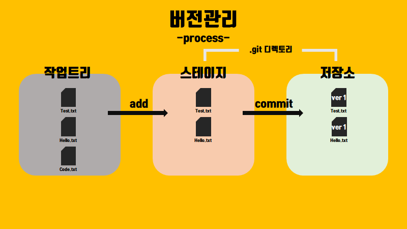
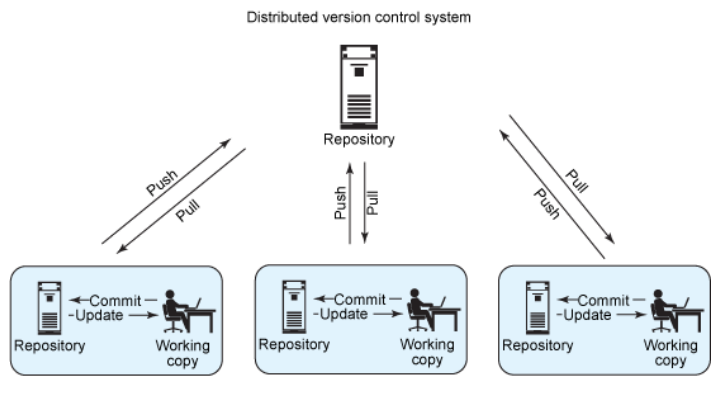

# basicWeb-study

# 1. Git 소개

> 소스 제어의 개념과 가장 많이 사용되는 버전 관리 시스템인 Git에 대해 알아보기

<aside>
💡 Git은 필수
</aside>

## 버전 관리란?

VCS(버전 관리 시스템)은 파일의 변경 내용을 추적하는 프로그램이다.

VCS의 목표는 개별 파일 또는 전체 프로젝트의 이전 버전을 쉽게 되돌리는 것이다.

또 다른 목표는 여러 팀원이 서로의 작업에 영향을 주지 않고 동시에 한 프로젝트, 동일한 파일에서도 작업할 수 있도록 하는 것이다.

VCS의 또 다른 이름은 SCM(소프트웨어 구성 관리)시스템이다. 두 용어는 서로 바뀌어 사용되는 경우가 많다.

- Git 공식 설명서 참조

[git-scm.com](https://git-scm.com/)

### VCS의 기능

- 프로젝트의 모든 변경 내용, 변경된 시간 및 변경한 사용자를 확인
- 각 변경 내용과 함께 변경 이유를 설명하는 메시지를 포함
- 전체 프로젝트 또는 개별 파일의 이전 버전을 검색
- 실험적으로 변경할 수 있는 분기를 생성
    - 기본 분기에 영향을 주지 않고 여러 사람이 동시에 다양한 변경 작업을 수행할 수 있다.
    (예: 기능 또는 버그 수정)
    - 새 릴리즈를 표시하기 위해 버전에 태그를 연결

### 분산형 버전 관리

- Git 이전의 VCS에서는 중앙 집중식 서버를 사용하여 프로젝트 기록을 저장하였다. 
이러한 구성에서는 한 서버가 잠재적 단일 실패 지점이기도 하였다.
- Git은 분산형이므로 프로젝트의 전체 기록이 클라이언트(예: PC)와 서버에 모두 저장된다.
- 네트워크에 연결하지 않고 파일을 편집하고, 서버와 동기화할 수 있다.
- 서버가 다운되는 경우에도 프로젝트에 로컬 복사본이 존재한다.
- 극단적으로 서버가 없어도 사용할 수 있다.

### Git 용어

- 작업 트리: 작업 중인 프로젝트를 포함하는 중첩된 디렉토리 및 파일
- 레포지토리(repo) : 작업 트리의 최상위 수준에 있는 루트 디렉토리로, Git은 프로젝트의 모든 기록 및 메타데이터를 여기에 보관
- 해시: 해시 함수에서 생성된 숫자로, 파일 또는 다른 개체의 컨텐츠를 고정 자릿수로 나타낸다.
Git은 160비트 길이의 해시를 사용한다. 해시를 사용하는 이유는 Git은 해당 컨텐츠를 해시하고 결과를 이전 해시와 비교하여 파일이 변경되었는지의 여부를 알려준다는 것이다. 파일의 시간 및 날짜 스탬프가 변경되었지만 파일 해시는 변경되지 않는 경우 Git은 파일 내용이 변경되지 않았다는 것을 알고 있다는 것을 의미한다.
- 개체: Git 레포지토리에는 각각 SHA-1 해시를 통해 고유하게 식별되는 네 가지 ‘개체’ 유형이 포함된다. 
blob 개체는 일반 파일을 포함한다. tree 개체는 디렉토리를 나타내며, 여기에는 이름, 해시 및 권한이 포함된다. commit 개체는 특정 버전의 작업 트리를 나타낸다. tag는 커밋에 연결된 이름이다.
- commit: 동사로 사용될 때 ‘커밋’은 커밋 개체를 만드는 것을 의미한다. 이 작업은 커밋에서 데이터베이스로 이름을 가져온다. 즉, 다른 사용자도 볼 수 있도록 변경 내용을 커밋하는 것이다.
- branch: branch는 연결된 커밋의 명명된 시리즈이다. 분기의 가장 최근 커밋을 ‘헤드'라고 한다. 레포지토리를 초기화할 때 생성되는 기본 분기를 main  이라고 하며, Git에서는 흔히 master라고 한다. 현재 분기의 헤드는 HEAD라고 한다. 개발자가 분기에서 개별적으로(또는 함께) 작업하고 나중에 변경 내용을 기본 분기에 병합할 수 있기 때문에 branch는 매우 유용한 기능이다.
- 원격: 원격은 다른 Git 레포지토리에 관한 참조이다. 레포지토리를 만들 때 Git은 push 및 pull 작업의 기본 branch인 origin이라는 원격을 만든다.
- 명령, 하위 명령, 옵션: Git 작업은 git push 및 git pull과 같은 명령을 사용하여 수행된다. git은 명령이고 push 또는 pull은 하위 명령이다. 하위 명령은 Git에서 수행하려는 작업을 지정한다. 일반적으로 명령은 하이픈(-) 또는 이중 하이픈 (—)을 사용하는 옵션과 함께 사용된다. 예: git reset —hard
